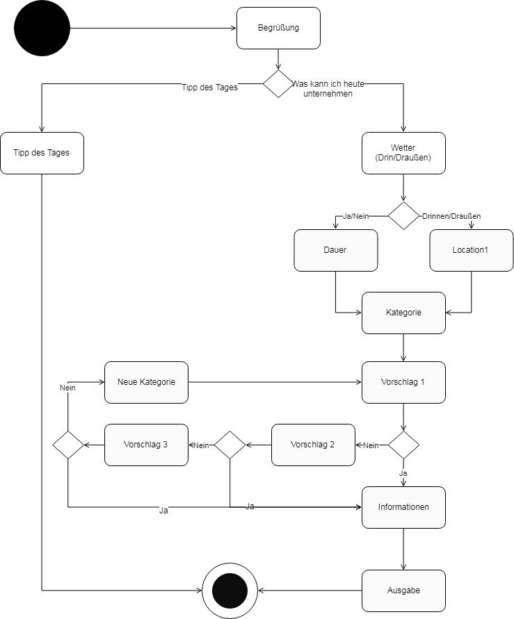

# Skill Name: MUCtivities

## Status

Der Skill wurde auf Deutsch übersetzt, es wurden Tests hinzugefügt und eine eigene Model-Klasse implementiert.

Fertige Releases:
https://github.com/sweIhm-ws2018-19/skillproject-fr-26/releases

## Systemarchitektur

## Anwendungsfalldiagramm

## Klassendiagramm des AWS Lambda Funktion

## Aktivitätsdiagramm 

## Sonstiges
Was ich gelernt habe: viel!

## Präsentation:
<a href="https://github.com/sweIhm-ws2018-19/skillproject-fr-26/blob/master/MUCtivities/Dokumente/Dropbox/MUCtivities%20Pr%C3%A4si.pdf?raw=true">Link zu Präsentation</a>
